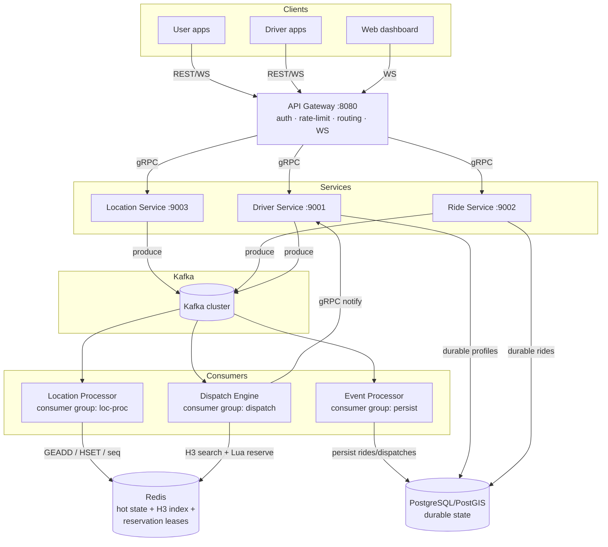
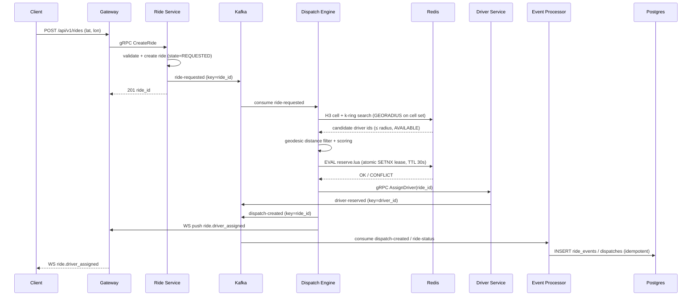

# NEXUS-DISPATCH — System Design & Architecture

**Distributed Real-Time Geo-Tracking & Intelligent Dispatch Engine**

> A fault-tolerant, high-concurrency geo-dispatch platform engineered for real-time
> driver tracking, sub-second proximity matching, distributed booking coordination,
> and horizontally scalable event processing.

---

## 1. Problem Statement

Ride-hailing / delivery platforms must continuously ingest GPS updates from a large
fleet, answer "who is available near (lat, lon)?" in milliseconds, and — under heavy
concurrency — guarantee that **no driver is ever assigned to two active rides at the
same time**, even when two users request the same driver from different API
instances at the same instant.

This project implements that end-to-end: ingestion, geospatial indexing, candidate
ranking, atomic reservation, event streaming, durable persistence, real-time client
push, observability, and reproducible load/failure testing.

## 2. Requirements

### Functional
| # | Requirement |
|---|-------------|
| F1 | Register drivers and users; manage driver availability state machine |
| F2 | Ingest high-frequency GPS updates; validate, dedupe, order |
| F3 | Partition geographic space (H3) and find nearby available drivers |
| F4 | Rank candidates (distance, request age, constraints) |
| F5 | Dispatch a driver to a ride request; atomically reserve |
| F6 | Prevent double-booking under concurrent requests (the core invariant) |
| F7 | Stream all domain events through Kafka |
| F8 | Keep hot real-time state in Redis; durable business state in PostgreSQL/PostGIS |
| F9 | gRPC for internal service-to-service calls; REST for public API |
| F10 | WebSocket fan-out of real-time events to clients |
| F11 | JWT auth (USER/DRIVER/ADMIN), rate limiting, request IDs |
| F12 | Metrics, distributed tracing, structured logs |

### Non-Functional
| # | Requirement | Target (measured, not assumed) |
|---|-------------|-------------------------------|
| N1 | Dispatch p99 latency (candidate search → reservation) | < 100 ms at 1k concurrent drivers |
| N2 | Location ingestion throughput | ≥ 50k updates/s per location-service instance (measured) |
| N3 | Reservation invariant | `successful_reservations(driver_id) ≤ 1` — always, tested at 1000 concurrent |
| N4 | Availability | Degraded mode: dispatch still works if Postgres is down (hot state in Redis) |
| N5 | Durability | Every completed ride and dispatch decision is durably persisted |
| N6 | Idempotency | Duplicate Kafka events never create duplicate assignments |
| N7 | Observability | Every request carries a request/trace id; p50/p95/p99 exposed |

## 3. Architecture Overview



### Service responsibilities

| Service | Port | Owns | Talks to |
|---------|------|------|----------|
| **API Gateway** | 8080 | JWT verification, token-bucket rate limiting (Redis), request IDs, timeouts, WS hub, REST→gRPC translation | gRPC clients; Redis; WS clients |
| **Driver Service** | 9001 | Driver registration, profiles, state machine (OFFLINE/AVAILABLE/RESERVED/ON_TRIP/PAUSED), availability transitions | Postgres; Kafka (driver-status); Redis (availability flag) |
| **Location Service** | 9003 | GPS validation, sequence stamping, H3 cell computation, Kafka publish, Redis hot-state write, stale-driver detection | Kafka; Redis |
| **Ride Service** | 9002 | Ride lifecycle (REQUESTED→MATCHED→…→COMPLETED/CANCELLED), ride queries, cancellation | Postgres; Kafka (ride-requested, ride-status) |
| **Dispatch Engine** | 9004 (gRPC) | H3 neighborhood search, candidate scoring, **atomic reservation via Lua**, dispatch records, driver notification | Redis; Kafka (ride-requested, dispatch-created, driver-reserved); Driver Service (gRPC) |
| **Location Processor** | — | Kafka consumer: writes Redis geo state, enforces sequence ordering, detects stale drivers | Kafka; Redis |
| **Event Processor** | — | Kafka consumer: persists ride/dispatch/status events to Postgres idempotently | Kafka; Postgres |

### Data flow for a ride request



## 4. Geospatial Indexing (H3)

We use **H3 resolution 7** (~1.22 km² cells) as the primary spatial partition,
implemented on top of Redis **Geo structures** (geohash zsets) — see ADR-004 for the
full rationale.

**Why not scan all drivers?** With N drivers, a naive scan is O(N) per request.
With H3 partitioning, a request touches only the drivers in its cell + k-ring
neighbors: O(N · A_cell/A_total), which for a city-scale deployment is a few hundred
candidates regardless of fleet size.

### Search algorithm

```
request(lat, lon, radius_m)
  1. cell0 = h3.latLngToCell(lat, lon, res=7)
  2. ring  = h3.gridDisk(cell0, k=2)          # 19 cells, covers ~2.4 km at res 7
  3. for each cell in ring:
         candidates += SMEMBERS h3:{cell}:drivers
  4. for each candidate:
         d = haversineMeters(req, driver.lastPos)   # geodesic, NOT road distance
         if d <= radius_m: keep
  5. rank by score = w1·d + w2·requestAge + w3·(1 - driverRating/5)
```

**Cell-boundary correctness:** a driver near a cell boundary is a member of exactly
one cell (the cell of its *last* position). A request near the boundary searches the
k-ring, so a driver at distance ≤ radius is always in some searched cell as long as
`radius ≤ cell radius × k` (res-7 cell circumradius ≈ 400 m; k=2 covers ≈ 1.2 km
from the ring edge). The search radius is therefore capped at `k × cellRadius`
(default 1000 m, configurable) — and `tests/integration` contains a **boundary test**
that places drivers at every cell edge and asserts none are missed.

**Out-of-radius edge case:** if a request asks for radius > k×cellRadius, the engine
expands k (k = ceil(radius / cellRadius) + 1) rather than scanning everything.

## 5. Kafka Architecture

| Topic | Partition key | Partitions | Producer | Consumer (group) | Ordering requirement | Retention |
|-------|--------------|-----------|----------|------------------|----------------------|-----------|
| `driver-location` | `driver_id` | 12 | Location Service | `loc-proc` (Location Processor) | **Per-driver ordering** (sequence) | 1h |
| `ride-requested` | `ride_id` | 8 | Ride Service | `dispatch` (Dispatch Engine) | Per-ride | 1h |
| `driver-reserved` | `driver_id` | 12 | Dispatch Engine | `loc-proc`, `persist` | Per-driver | 24h |
| `dispatch-created` | `ride_id` | 8 | Dispatch Engine | `persist` (Event Processor), gateway WS bridge | Per-ride | 24h |
| `ride-status` | `ride_id` | 8 | Ride Service, Dispatch | `persist`, gateway WS bridge | Per-ride | 24h |
| `driver-status` | `driver_id` | 12 | Driver Service | `loc-proc`, `persist` | Per-driver | 24h |
| `nexus-dead-letter` | original key | 3 | any consumer (on retry exhaustion) | operator alerting | — | 7d |

**Why `driver_id` as partition key for locations?** A single driver's updates must
be processed in order (sequence numbers must be monotonic per driver). Kafka gives
per-partition ordering, so keying by `driver_id` puts one driver's stream in one
partition → in-order delivery to the consumer group. Keying by `ride_id` or round-
robin would interleave a driver's updates and break sequence-based dedupe.

**Why `ride_id` for ride topics?** All events of one ride (requested → reserved →
arrived → completed) must be ordered for the persistence consumer to apply state
transitions correctly.

**Consumer guarantees:**
- **Idempotent consumers** — every handler checks a monotonic key (location:
  `sequence`; ride: `ride_id + state` transition validity; dispatch: `dispatch_id`
  uniqueness) before mutating state. Re-delivery is a no-op.
- **Retries** — 3 attempts with exponential backoff (100 ms, 400 ms, 1.6 s); on
  exhaustion the record is published to `nexus-dead-letter` with the original key and
  an error header, then committed.
- **Offset handling** — commit after successful processing (at-least-once +
  idempotency = effectively-once effect).
- **Graceful shutdown** — SIGTERM → stop consuming → drain in-flight → commit offsets
  → close.

## 6. Redis Architecture (hot state)

Redis holds **hot, real-time, loss-tolerant** state. Losing it degrades the system
(dispach uses last-known positions; availability re-derives from Postgres on
restart) but never corrupts durable business data.

### Key model

| Key | Type | TTL | Purpose |
|-----|------|-----|---------|
| `driver:{id}` | hash | none (evict-safe) | profile cache: name, vehicle, rating, state |
| `driver:{id}:loc` | hash | 120 s | last position: lat, lon, h3_cell, seq, ts |
| `driver:{id}:lease` | string | 30 s | **reservation lease**: value = `ride_id:token:version` |
| `h3:{cell}:drivers` | set | none | drivers whose last position is in `cell` |
| `geo:drivers` | geo (zset) | none | global geohash index (fallback + GEORADIUS sanity) |
| `ride:{id}` | hash | 30 min | hot ride state for dispatch decisions |
| `ratelimit:{scope}:{id}` | hash | 2×window | token bucket (capacity, tokens, ts) |
| `seq:{driver_id}` | string | 1 h | last-applied location sequence (out-of-order guard) |

### Consistency behavior
- Location state: **eventually consistent**, last-writer-wins **by sequence number**,
  not by wall clock (see `seq:{driver_id}` guard in a Lua script — atomic compare-and-set).
- Availability: **strongly coordinated** via the lease key (see §7).
- Bounded memory: every hot key has a TTL or is bounded by driver count; cell sets
  are rebuilt from the geo index on startup, never grown unbounded.

## 7. Reservation Correctness (the core invariant)

**Invariant:** `successful_reservations(driver_id) ≤ 1` at any instant.

Mechanism: a single **Lua script** executed atomically by Redis:

```lua
-- KEYS[1]=driver:{id}:lease  KEYS[2]=driver:{id}
-- ARGV[1]=ride_id  ARGV[2]=token  ARGV[3]=version  ARGV[4]=ttl
if redis.call('EXISTS', KEYS[1]) == 1 then
    local owner = redis.call('GET', KEYS[1])
    if owner == ARGV[2] then            -- re-entrant: same ride extending lease
        redis.call('SET', KEYS[1], ARGV[2], 'EX', ARGV[4])
        return 1
    end
    return 0                            -- CONFLICT: someone else owns the lease
end
if redis.call('HGET', KEYS[2], 'state') ~= 'AVAILABLE' then
    return -1                           -- driver not in a reservable state
end
redis.call('SET', KEYS[1], ARGV[2], 'EX', ARGV[4])
redis.call('HSET', KEYS[2], 'state', 'RESERVED', 'reserved_ride', ARGV[1])
return 1
```

Because Redis executes the script atomically, two concurrent reservations for the
same driver serialize: exactly one sees `EXISTS == 0` and wins.

**Failure semantics:**
- **TTL (30 s)** — if the dispatch engine crashes after winning but before notifying
  the driver, the lease expires and the driver becomes reservable again. The ride
  stays REQUESTED (dispatch is retried) or is cancelled by its own timeout.
- **Renewal** — the dispatch engine renews the lease (same token → re-entrant path)
  every 10 s while the driver is being notified.
- **Crash of the winner** — covered by TTL; no manual release needed.
- **Stale ownership** — the lease value carries a monotonic `version`; a stale
  releaser holding an old version cannot delete a newer lease (release is a
  compare-and-delete Lua script).
- **Postgres backstop** — the `dispatches` table has a **unique partial index** on
  `driver_id WHERE state IN ('RESERVED','ASSIGNED','ON_TRIP')` as a durable second
  line of defense: even if Redis were bypassed, the DB rejects a second active
  dispatch for a driver.

**Why not a plain `SET NX`?** `SET NX` alone does not check driver state, is not
re-entrant for lease renewal, and release would be a blind `DEL` (a crashed holder's
stale release could delete a *new* owner's lease). The Lua script + versioned
compare-and-delete closes all three holes. See ADR-006.

## 8. Consistency Model

| State | Guarantee | Mechanism |
|-------|-----------|-----------|
| Driver reservation | **Strong** (single-writer via atomic script) | Redis Lua lease; Postgres unique partial index backstop |
| Driver availability state | **Strong** for transitions (state machine enforced in Driver Service + checked in reserve script) | gRPC + Redis HSET |
| Location | **Eventually consistent**, per-driver total order by `sequence` | Kafka per-driver partition + seq CAS in Redis |
| Ride state | **Strong** within Ride Service (single writer per ride via partition key); **eventually consistent** across replicas | Kafka `ride_id` keying |
| Historical trip/dispatch records | **Durable**, at-least-once write, idempotent upserts | Postgres; `ON CONFLICT DO NOTHING` |
| Metrics/caches | Best effort | TTLs, rebuildable |

**Ordering guarantees:** per-key (per-driver / per-ride) total order via Kafka
partitioning; no cross-key ordering is promised or needed.

**Idempotent operations:** login (JWT stateless), location ingest (seq guard),
event persistence (unique constraint + ON CONFLICT), dispatch (unique dispatch_id).

## 9. Failure Handling

| Failure | Detection | Behavior |
|---------|-----------|----------|
| Kafka broker down | producer error / consumer rebalance | Producer: retry w/ backoff, buffer in memory (bounded 10k), then drop + metric `kafka_produce_errors_total`; Consumer: librdkafka auto-reconnect, offsets committed only on success |
| Redis down | dial/timeout | Location writes fall back to Kafka-only (state rebuilds on recovery from geo index); Dispatch returns 503 `service_unavailable` (fail-closed for reservations — we would rather reject a ride than risk double-booking); circuit breaker opens after 5 consecutive failures, half-opens after 10 s |
| Postgres down | pool errors | Dispatch + location keep working (hot state in Redis); Event Processor buffers + retries with backoff; Driver/Ride registration returns 503 (registration needs durable state) |
| Service instance down | gRPC deadline / gateway health | Gateway retries idempotent calls once; Kafka consumer group rebalances partitions to survivors |
| Duplicate Kafka messages | seq guard / unique constraints | no-op (idempotent consumers) |
| Out-of-order locations | `seq:{driver_id}` CAS | older update rejected + counted in `location_updates_stale_total` |
| Stale drivers | heartbeat check (no update in 30 s) | marked OFFLINE in Redis, removed from cell sets, `driver-status` event emitted |

## 10. Scalability

- **Stateless services** — gateway, driver, ride, location, dispatch all scale by
  adding instances; all coordination is in Kafka/Redis/Postgres.
- **Kafka** — partitions are the unit of parallelism; consumer groups spread
  partitions across instances. 12 location partitions → up to 12x location consumer
  parallelism.
- **Redis** — hot path is O(cell) not O(fleet); for multi-region, cluster-mode with
  cell-key hashing keeps a city's cells co-located (documented in ADR-010).
- **Postgres** — only durable, low-frequency writes (rides, dispatches, history);
  GPS updates never touch it in the hot path (they land in `driver_history` via the
  Event Processor in batches, downsampled to 1 update/5 s).
- **Gateway WS** — each gateway instance owns its own WS connections; cross-instance
  fan-out goes through the `dispatch-created`/`ride-status` Kafka topics (every
  gateway instance subscribes a WS bridge consumer), so any instance can push to any
  client.

## 11. Security

- JWT (HS256 for dev, RS256-ready) with roles USER/DRIVER/ADMIN; verified at the
  gateway; role checked per-route (e.g. `PATCH /drivers/{id}/status` requires
  DRIVER and ownership, or ADMIN).
- Token-bucket rate limiting in Redis: per-user (60 req/min) and per-IP (300
  req/min), configurable; WS handshake requires a short-lived token query param.
- Input validation everywhere (coordinate bounds, size limits 64 KB body, path
  params); parameterized SQL only (sqlx); no secrets in code (env vars,
  `.env.example` provided).
- Secure headers (HSTS, X-Content-Type-Options, X-Frame-Options, CSP) on gateway.
- TLS-ready: all services accept `TLS_CERT/TLS_KEY` env vars; compose ships without
  TLS (documented) but the code path is exercised in tests.

## 12. Observability

- **Metrics** (Prometheus `/metrics` on every service): the full list from the spec
  (requests_total, request_latency histogram p50/p95/p99, dispatch_latency,
  dispatch_success/failure_total, location_updates_total, kafka_messages_total,
  kafka_consumer_lag, redis_operations_total, redis_latency, database_latency,
  active_drivers, available_drivers, active_rides, reservation_conflicts,
  websocket_connections).
- **Tracing** — OpenTelemetry: gateway → gRPC (propagated context) → Kafka
  (traceparent in message headers) → consumer → Redis/Postgres spans. Exported to
  Jaeger via OTLP.
- **Logging** — structured JSON (slog), every line carries `service`, `request_id`,
  `trace_id`, plus entity ids; secrets are never logged (redaction middleware).

## 13. Trade-offs (summary — full ADRs in `docs/decisions/`)

1. **Redis as the coordination point** is a single point of failure for
   reservations. Accepted because: (a) it is loss-tolerant (TTLs self-heal), (b) the
   Postgres unique index is a durable backstop, (c) a Redis Sentinel/cluster is a
   documented scaling step. A pure-Postgres `SELECT … FOR UPDATE` design was
   rejected for the hot path (see ADR-006).
2. **At-least-once Kafka + idempotent consumers** instead of exactly-once
   transactions: simpler, works across producer/consumer groups, and the
   idempotency keys we already have (seq, dispatch_id) make it safe.
3. **Geodesic distance for ranking, not road distance**: a real routing engine
   (OSRM/Valhalla) is a documented extension point; the score formula isolates the
   distance term so it can be swapped without touching dispatch logic.
4. **H3 res 7 fixed** for city-scale; the resolver is configurable and the search
   expands k-ring with radius, so regional deployments can tune without code change.

## 14. Future Improvements

- Multi-region sharding by H3 res-5 region; Redis Cluster.
- Real road-network distance via a routing microservice (OSRM) behind the same
  scorer interface.
- ML-based ETA + acceptance-probability ranking.
- Kafka KRaft mode (already used in compose) + tiered storage.
- Kubernetes HPA on custom metrics (dispatch p99, Kafka lag).